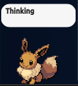

# petwatch

Pet de desktop que observa um servidor [opencode](https://opencode.ai) local
e mostra o que está acontecendo: pronto, trabalhando ou aguardando resposta —
um balão por sessão em ação.



[](https://github.com/diegoherculano/pet-opencodev2/actions)
[](LICENSE)
[](pyproject.toml)

## Recursos

- Um balão por sessão do opencode em ação, com o nome da sessão
- "Aguardando resposta" verificado no servidor — nunca chutado do stream
- Roda em segundo plano: o prompt volta na hora, `--status` / `--stop`
- Windows e Linux: o mesmo código, e um `petwatch.exe` que não precisa de Python
- Eevee incluso; pacote opcional com 1738 temas, seletor com busca, 3 tamanhos, sempre no topo, ícone na bandeja
- Só lê: nenhum `POST`/`DELETE`, então não responde nem interrompe nada

## Requisitos

- Python >= 3.11 com Qt (PySide6), em Linux, macOS ou Windows
- Servidor `opencode` local rodando
- No Ubuntu, o plugin de WebP do Qt: `sudo apt install qt6-image-formats-plugins`
  (nos wheels do PySide6 ele já vem junto; no Windows o `.exe` carrega o seu)

Quem não quiser instalar nada no Windows pode baixar o `petwatch.exe`: um
arquivo único, sem Python, sem PySide6 e sem plugin de Qt na máquina.

## Instalação

```bash
pip install -e .
```

O repo já traz o tema padrão (`pets/eevee`), então um clone fresco abre o
pet sem mais nada. O pacote completo (1738 temas) é opcional e vem de
[codex-pokepets](https://github.com/dnnyngyen/codex-pokepets) — mesmo layout
(um diretório por tema, com `pet.json`):

```bash
git clone --depth 1 https://github.com/dnnyngyen/codex-pokepets /tmp/pokepets
cp -r /tmp/pokepets/pets/* pets/
```

Sprites de terceiros: © Nintendo / Game Freak / Creatures Inc., uso de fã
sem fins comerciais (ver a licença do repo de origem).

Sem instalar também funciona, direto da fonte:

```bash
python pet.py            # ou: python -m petwatch
```

### Windows

```powershell
pip install -e .
python -m petwatch
```

Ou o executável único, que não depende de nada instalado:

```powershell
py -3 -m pip install pyinstaller
py -3 -m PyInstaller petwatch.spec --noconfirm   # -> dist\petwatch.exe
```

O build precisa rodar no Windows — o PyInstaller não faz cross-compile — e o
CI o faz em `windows-latest`. Os 1738 pets são opcionais nos dois sistemas:
o `.exe` embute só o tema padrão, e a coleção completa é procurada em
`pets/` ao lado do executável, em `%LOCALAPPDATA%\petwatch\pets` ou no que
`$PETWATCH_PETS_DIR` apontar.

## Uso

```bash
python pet.py              # segundo plano; prompt volta na hora
python pet.py --status     # está rodando? qual o pid?
python pet.py --stop       # encerra
python pet.py --foreground # colado no terminal (aqui o Ctrl+C funciona)
```

- **Botão esquerdo** arrasta o pet · **botão direito** abre o menu
- Log em `~/.local/state/petwatch/pet.log` (Linux/macOS) ou
  `%LOCALAPPDATA%\petwatch\pet.log` (Windows); prefs em
  `~/.config/petwatch/prefs.json` ou `%APPDATA%\petwatch\prefs.json`
- Observar um projeto só: `PETWATCH_DIRECTORY=/caminho/do/projeto python pet.py`
- Porta fixa, pulando a busca: `PETWATCH_PORT=4096 python pet.py`
- Senha pronta, sem chamar o CLI: `PETWATCH_PASSWORD=... python pet.py`

### Pet no Windows com o opencode no WSL

Funciona sem configurar nada: a porta do WSL aparece no Windows via
`wslrelay`, e o pet lê a senha de lá (`wsl` + `~/.opencode/bin/opencode2
service get password`, com o `service.json` de reserva). Se o pet ficar
em "conectando", confira o log em `%LOCALAPPDATA%\petwatch\pet.log` e, se
precisar, fixe a senha uma vez:

```powershell
wsl cat ~/.config/opencode/service.json   # copie o "password"
setx PETWATCH_PASSWORD "cole-aqui"         # vale para os próximos arranques
```

Reinicie o pet depois do `setx`.

No `petwatch.exe` (sem console) o `--status` e o `--stop` respondem numa
caixa de diálogo, porque um duplo clique não tem terminal onde mostrar.

## Documentação

- [`docs/OPERATION.md`](docs/OPERATION.md) — segundo plano, menu, prefs, log
- [`docs/ARCHITECTURE.md`](docs/ARCHITECTURE.md) — pipeline, eventos, watchdog, sprites
- [`docs/BUILD.md`](docs/BUILD.md) — como gerar o `petwatch.exe`
- [`docs/TESTING.md`](docs/TESTING.md) — a suíte de 677 testes
- [`docs/BUGS.md`](docs/BUGS.md) — histórico de bugs corrigidos
- [`CHANGELOG.md`](CHANGELOG.md) — mudanças por versão

## Contribuindo

Leia o [`CONTRIBUTING.md`](CONTRIBUTING.md) antes do PR. Toda interação segue
o [`Código de Conduta`](CODE_OF_CONDUCT.md). Vulnerabilidades: siga o
[`SECURITY.md`](SECURITY.md), nunca abra issue pública.

## Licença

MIT — ver [`LICENSE`](LICENSE).
